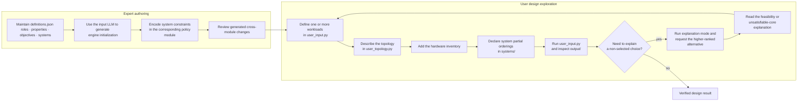

# Archie: Lightweight Design and Verification tool for System Architects

Archie is a lightweight yet expressive constraint-based design and verification tool for system architects. It aids in providing a formally verified and optimal set of system choices based on user-defined topology, hardware inventory, workload properties, objectives, and user-derived partial orderings of available systems. This artifact provides the source code and set template for using and extending Archie, includes a microservice-design case study covering container runtimes, orchestration, service meshes, RPC frameworks, and autoscalers and a set of illustrative case-study workloads to showcase hardware dependencies and explainability. You can find more information about these evaluations and their comparison to an LLM in our paper. 

## Artifact layout

| Directory | Purpose |
| --- | --- |
| [`src/`](src) | Archie’s Python modeling, optimization, and explanation engine. |
| [`hardware/`](hardware) | A hardware catalogue for extending Archie designs. Currently it has an empty file with template that follows from the hardware files in the directories of the examples.|
| [`systems/`](systems) | Set of files where each file encodes as many constraint for a particular system as possible, followed by the instantiatio of the system using the API Currently this folder is empty, as this will be filled by experts. |
| [`microservice_design_example/`](microservice_design_example/README.md) | Complete runnable microservice case study reflecting the example described in the paper. |
| [`illustrative_design_example/`](illustrative_design_example/README.md) | Complete runnable illustrative case study reflecting the example described in the paper. |
| `output/` | Generated reports; this directory intentionally has no README. |
| `user_input.py` | The input file template containing the main() function with the user's workload description, function call to topology creation, listing of objectives and their priorities and a switch to consider whether to trigger an explanation for the output. |
| `user_topology.py` | Function containing user's topology description using provided APIs. |

## Prerequisites

Use **Python 3.11.5 or later** and **Z3 4.13.0 or later**.  The code imports Z3 through its Python bindings; installing the `z3-solver` package provides the Z3 library required by the artifact, so a separate Z3 command-line installation is not required.

### Linux and macOS/Unix (Recommended)

From the repository root, create an isolated environment and install the required Z3 version:

```bash
python3 -m venv .venv
source .venv/bin/activate
python3 -m pip install --upgrade pip
python3 -m pip install "z3-solver>=4.13.0"
python3 --version
python3 -c 'import z3; print(z3.get_version_string())'
```

The last two commands must report Python >=3.11.5 and Z3 >=4.13.0.

### Windows (PowerShell) (Not tested and unverified)

```powershell
py -3.11 -m venv .venv
.\.venv\Scripts\Activate.ps1
py -m pip install --upgrade pip
py -m pip install "z3-solver>=4.13.0"
py --version
py -c "import z3; print(z3.get_version_string())"
```

If PowerShell blocks activation, run `Set-ExecutionPolicy -Scope Process -ExecutionPolicy Bypass` for the current shell, then activate the environment again.

## End-to-end Workflow

Archie separates **expert authoring** from **user design exploration**. Experts establish the vocabulary and encode the architectural knowledge; users then describe a concrete deployment and ask Archie to select and verify a design. The optional *input LLM* mentioned below is an external authoring assistant and is **not included** with this artifact. It may generate or update code, but experts and users remain responsible for reviewing every generated change.

This workflow also assumes a project-level `definitions.json` manifest. It is the authoritative list of available roles, workload properties, workload objectives, and candidate systems. If it is not already present in a deployment, create and maintain it before using an input LLM to generate Archie initialization code.



### Expert authoring

1. **Maintain the design vocabulary.** In order to get started, expert needs to update `definitions.json` with the supported workload properties, objectives, and roles. Keep names stable and unambiguous: user inputs, policy modules, and generated initialization code must use the same identifiers.
2. **Initialize the engine.** Provide the json manifest to the input LLM, which can add the corresponding Archie declarations and registration code. Review the generated code to ensure every declared role, property, objective, and system is registered before a `Workload` is constructed.
3. **Add system knowledge.** For each candidate system, the corresponding expert will encode its compatibility and resource constraints in the corresponding file under `systems/`. The input LLM may help add the constraint and update related registrations, configuration options, or ordering modules, but the expert must validate that the resulting policy matches the intended architectural rule. This will be a completely iterative process that may require significant time and effort, specifically in vetting/validation. 
4. **Review the complete change.** A new system or capability can affect the engine, hardware catalogue, workload definitions, and policy orderings. Check these changes together before making the vocabulary available to users.

### User design exploration

1. **Define workloads.** Select the applicable subset of properties and objectives from `definitions.json` for each workload. Ask the input LLM to place the resulting `Workload(...)` definitions, optimization priorities, and solver invocation in `user_input.py`. Ensure the objectives are ordered according to what they want to optimize for. Note that the objectives are defined, new ones cannot be created. It is recommended to always have the Optimization priorities for each objective (unless there is no preference) to reduce randomness in results. Please look at the examples provided to see how to construct this. 
2. **Describe the topology.** Implement the chosen devices and their hierarchy in `user_topology.py` using Archie’s topology APIs. The input module should call this topology constructor before it creates the workload. 
3. **Add the available hardware.** Provide the full hardware inventory to the input LLM so it can create the required `Hardware(...)` definitions and, when a new capability is introduced, update the engine declarations needed to model it. Review generated configuration keys carefully; every key must be supported by the relevant Archie device type. Again it's best to read the examples carefully and then follow the same template. 
4. **Declare partial orderings.** Add the objective-specific preference relations between systems in `systems/`. The input LLM can help with the `Ordering(...)` syntax, but the user should confirm that each relation expresses the intended preference and does not over-constrain the design.
5. **Run and inspect Archie.** Execute `user_input.py` using the platform-specific command below. Review the generated report in `output/` for the chosen systems, configurations, hardware assignments, and any warnings.

**Please take assistance from the input LLM for any addition of components to the code, as this allows for maintaining the right syntax and not result in crashes. If the LLM is not possible, an API definition is given for non-intuitive function calls for assistance.**

**NOTE: IF AND WHEN IN DOUBT, PLEASE COPY OVER THE EXAMPLE CODE AND MAKE CHANGES, AS THE SYNTAX WOULD BE PROPER AND COMPLETE IN THAT CASE**

### Reassessing a selected design

Use the `explain` flag when the baseline design is infeasible: Archie will refine and report the tracked constraints in the unsatisfiable core. To understand why a higher-ranked system was not selected in an otherwise feasible baseline, call `explain(workload_name, ordering_role, ordering_objective, fix_roles=...)`. Archie keeps the requested existing choices fixed, forces a higher-priority candidate in the specified role, and reports the constraints that prevent that alternative.

Use the exact identifiers declared in `definitions.json` and the engine—for example, `latency`, not a display label such as `Latency`. Supply `fix_roles` only for roles whose selected systems should remain fixed while evaluating the alternative. If no higher-ranked system exists for the requested role and objective, there is no alternative to explain.


### Linux and macOS/Unix (Highly Recommended)

```bash
unset PYTHONPATH
export PYTHONPATH="${PYTHONPATH}:."
python3 user_input.py > output/design.txt
```

If constraint explanations are intended:
```bash
unset PYTHONPATH
export PYTHONPATH="${PYTHONPATH}:."
python3 user_input.py explain > output/design.txt
```

### Windows (PowerShell) (Not Tested and unverified)

```powershell
New-Item -ItemType Directory -Force output | Out-Null
Remove-Item Env:\PYTHONPATH
$env:PYTHONPATH = "."
py > output\design.txt 2>&1
py explain > output\microservice_design_explain.txt 2>&1
```
If constraint explanations are intended:
```powershell
New-Item -ItemType Directory -Force output | Out-Null
Remove-Item Env:\PYTHONPATH
$env:PYTHONPATH = "."
py explain > output\microservice_design_explain.txt 2>&1
```

## Results

For how to adapt the case study, read [`microservice_design_example/README.md`](microservice_design_example/README.md) and [`illustrative_design_example/README.md`](illustrative_design_example/README.md)
